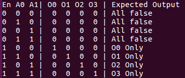
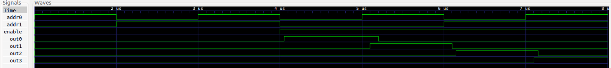
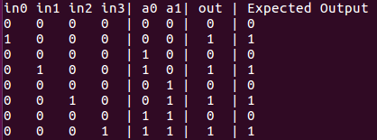
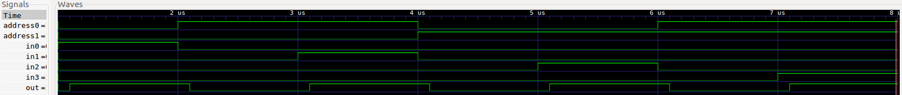
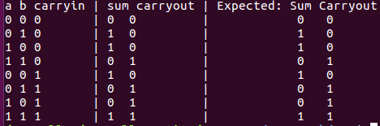

# Homework 2 Write UP
### By Daniel Connolly

## 2 bit decoder with enable (2+1 inputs, 4 outputs)
My decoder test bench returned the following truth table:

Additionally, the following decoder waveforms show the gate propagation delays:

## 4:1 (four input multiplexer)
My decoder test bench returned the following truth table:

Additionally, the following decoder waveforms show the gate propagation delays:

## 1-bit full adder
My decoder test bench returned the following truth table:

Additionally, the following decoder waveforms show the gate propagation delays:

